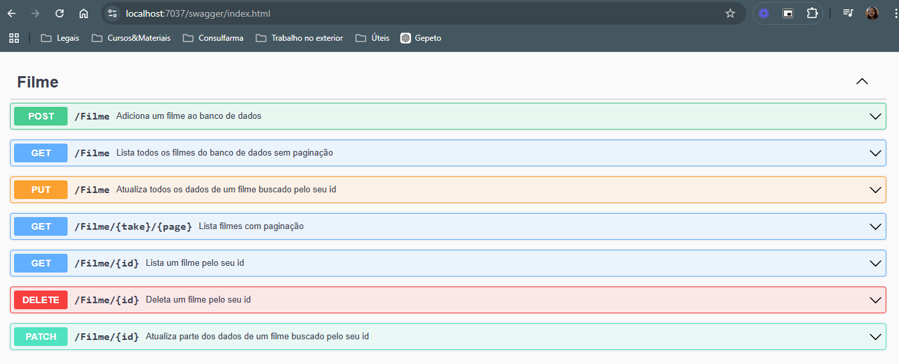

# FilmesAPI

Este projeto é um **ASP.NET Web API** para gerenciar filmes, desenvolvida em C# com ASP.NET Core. A API permite operações de CRUD para filmes e utiliza o AutoMapper para mapear dados entre diferentes modelos.


## Tecnologias Utilizadas
- ASP.NET Core
- Entity Framework Core
- AutoMapper
- Swagger

## Swagger
A página para consulta da documentação da API fica em http://localhost:<SUA_PORTA>/swagger no meu caso http://localhost:7037/swagger




## Estrutura do Projeto

Abaixo está a estrutura principal do projeto:

- **AutoMapProfiles**: Contém os perfis do AutoMapper para mapeamento de objetos, facilitando a conversão entre entidades e DTOs.
  - `Profiles.cs`: Define as configurações de mapeamento do AutoMapper.

- **Controllers**
  - `FilmeController.cs`: Controlador principal para as operações de CRUD dos filmes.

- **Data**
  - `DataContext.cs`: Classe de contexto do Entity Framework, responsável por configurar o banco de dados e definir as DbSets das entidades, como `Filme`.
  - Arquivos de migração: Usados para criar e atualizar o esquema do banco de dados.

- **Dtos (Data Transfer Objects)**
  - `CreateFilmeDto.cs`: DTO para criação de novos filmes, especificando apenas os campos necessários.
  - `UpdateFilmeDto.cs`: DTO para atualização de filmes, permitindo a modificação de dados específicos.

- **Models**
  - `Filme.cs`: Modelo principal que representa a entidade Filme.

## Pré-requisitos

- .NET 6 SDK ou superior
- Entity Framework Core

## Endpoints

A API disponibiliza endpoints para operações de CRUD (Create, Read, Update, Delete) nos filmes. Você pode usar o Swagger para testar os endpoints.

## Como Executar

1. Clone o repositório.
2. Configure as conexões de banco de dados em `appsettings.json`.
3. Execute o comando abaixo para aplicar as migrações e criar o banco de dados:
   ```bash
   dotnet ef database update   
4. Execute o comando abaixo  para dar start na aplicação:
   ```bash
   dotnet run
